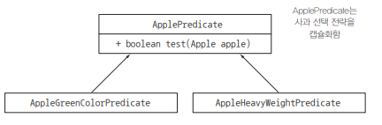

# 동작 파라미터화

- 참 또는 거짓을 반환하는 함수를 프레디케이트 라고 한다. 선택 조건을 결정하는 인터페이스를 정의하자.

```
public interface ApplePredicate {
    boolean test (Apple apple);
}
```

```
public class AppleHeavyWeightPredicate implements ApplePredicate {

    public boolean test(Apple apple) {
        return apple.getWeight() > 150;
    }
}

public class AppleGreenColorPredicate implements ApplePredicate {

    public boolean test(Apple apple) {
        return GREEN.equals(apple.getColor());
    }
}
```


위 조건에 따라 filter 메서드가 다르게 동작할 것이라고 예상할 수 있다. 이를 전략 디자인 패턴strategy design pattern 
(자세한 내용은 http://en.wikipedia.org/wiki/Strategy_pattern 참고)

